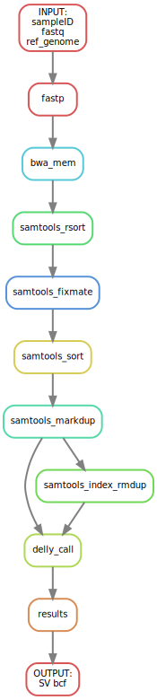

# Structural variation pipeline

This is a snakemake pipeline to process Illumina short-reads and perform SV with Delly

## Preparations
1. Programs are listed in the conda environment in `workflow/envs/environment.yaml`, it can be used to create a local environment or allow snakemake to create them with `--use-conda`
2. Inputs are the Fastq files and a reference genome, all specified in a `config.yaml` file
3. Output directory is specified with the `-d <dir>` parameter for snakemake
4. The pipeline can be run in a cluster if it is configured

## Configuration YAML
```
samples:
  - sampleID1
  - sampleID2
fastq_dir: /path/to/fastq/dir
genome: ref/genome.fa
```

## Execution

`snakemake --configfile <your-config.yaml> -d <output_dir>`

## Workflow




Juan Caballero 
(C) 2024